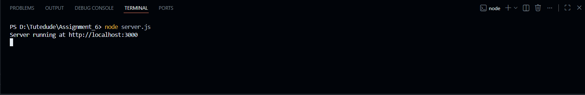
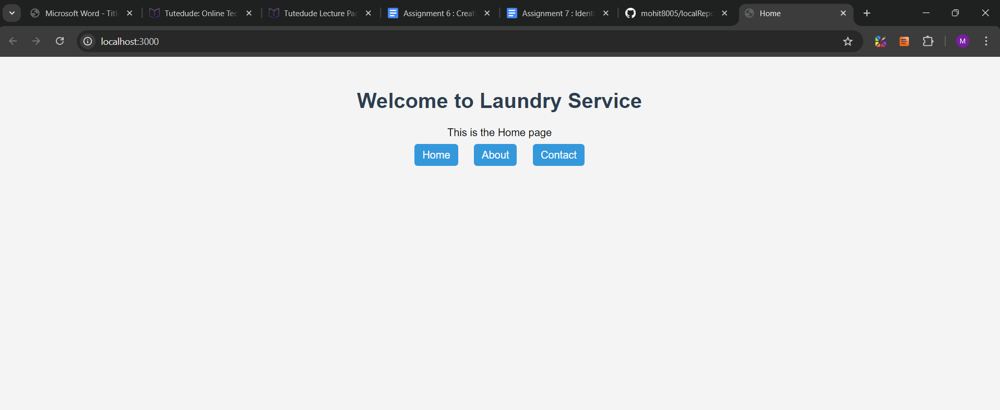
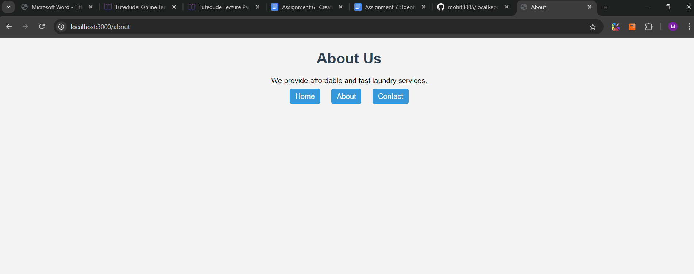
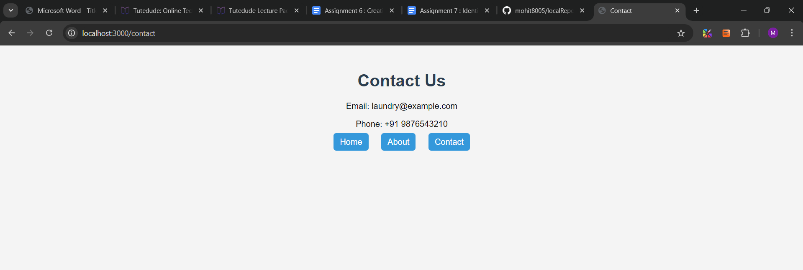
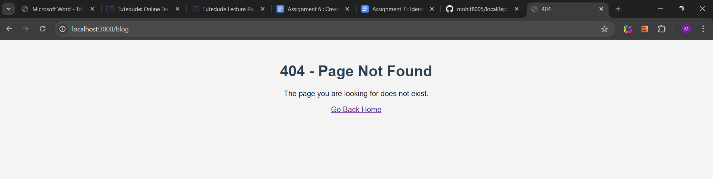

# Assignment 6 – Node.js Simple Web Server

## Objective
To create a simple web server using Node.js http module that serves different HTML pages using routing.

## Technologies
- Node.js
- HTML
- CSS

## How to Run
```bash
node server.js

## Description

This server is created using Node.js http module.
Routing is handled using req.url.
HTML files are served asynchronously using fs.readFile.
A custom 404 page handles invalid routes.


## Screenshots

### Server Running


### Home Page


### About Page


### Contact Page


### 404 Page
